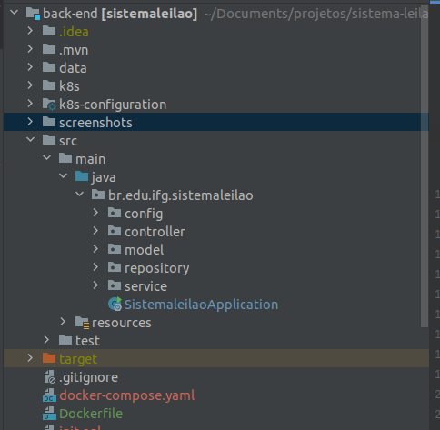
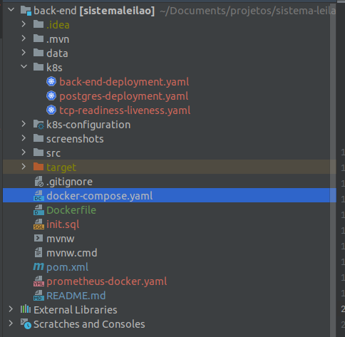
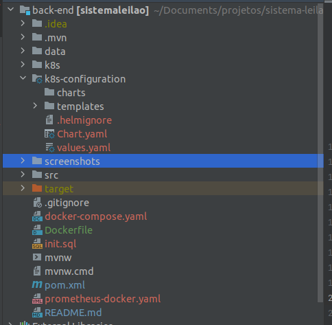

# Projeto de DevOps

Utilizei um antigo projeto de leilao, que tinha funcionalidades como CRUD de participantes, CRUD de leiloes, e a criação de lances e fechamento do leilao. O projeto foi realizado em Java com Spring Boot e o banco de dados escolhido foi Postgres

## Prints sobre o Projeto de DevOps

### Prints da estrutura do projeto
#### Projeto Java

#### Kubernetes

### Print do dockerfile da API

### Prints do yaml de deployment e service da API

### Prints do yaml de deployment, service e pv e pvc do postgres

### Imagem no dockerhub
[imagem no dockerhub](https://hub.docker.com/repository/docker/jvgontijo/back-end-leilao/general)

### Prints do prometheus

### Print monstrando os pods, services, deployments, no kubernetes

### Prints dos testes no JMeter

### Print de um gráfico da api spring no Grafana

	

