# Prints sobre o Projeto de DevOps

### Print do dockerfile da API
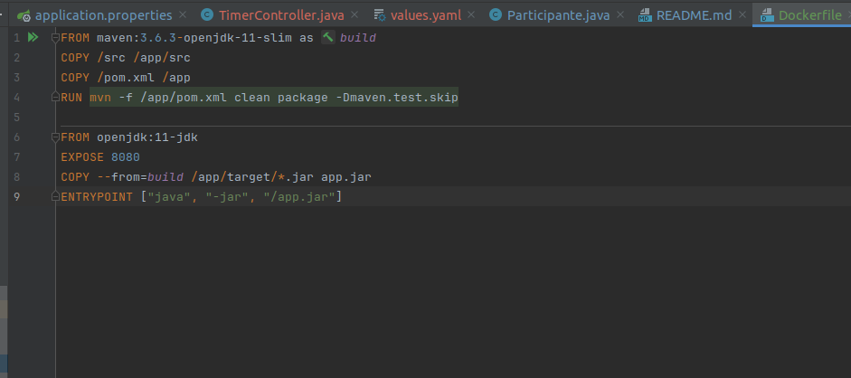

### Prints do yaml de deployment e service da API
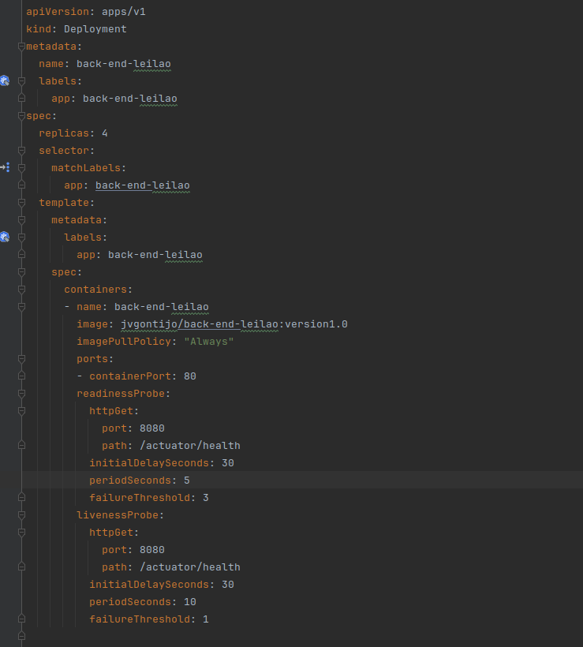
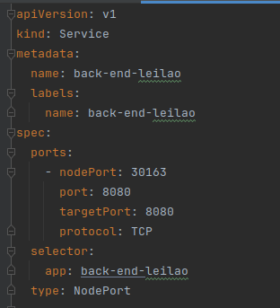

### Prints do yaml de deployment, service e pv e pvc do postgres
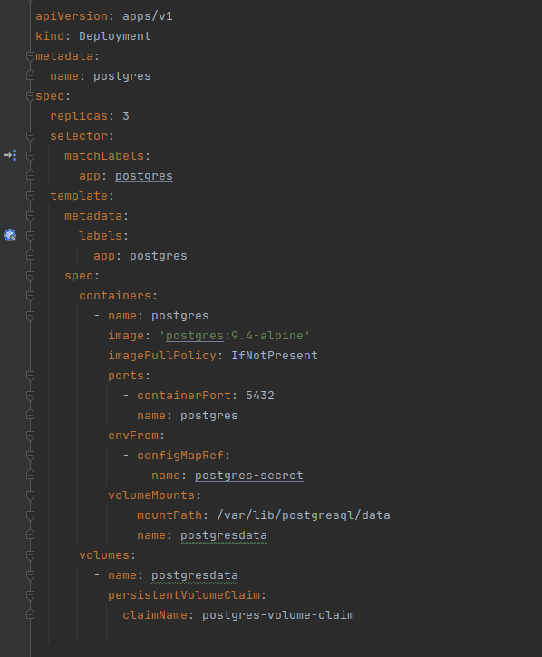
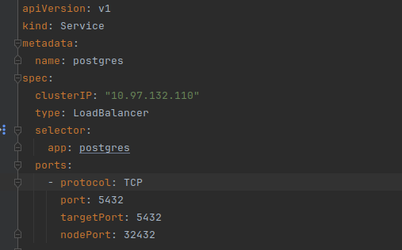
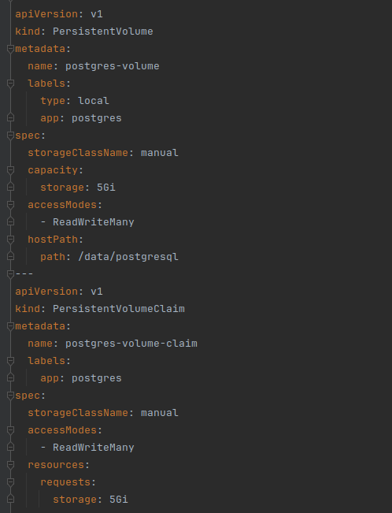

### Imagem no dockerhub

### Prints do prometheus
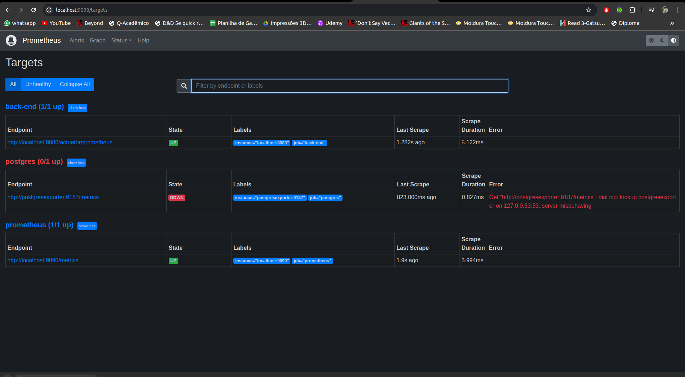
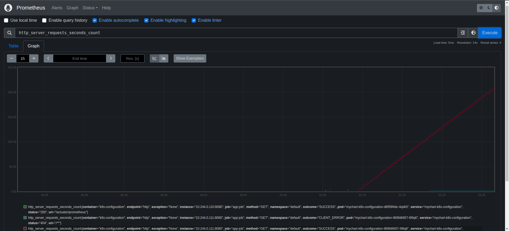
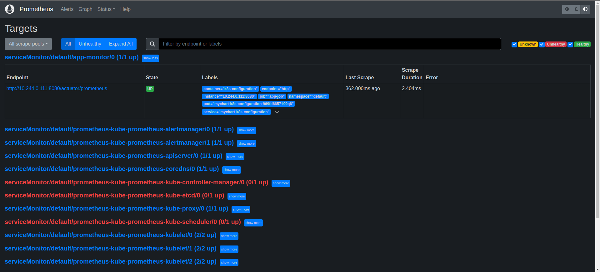

### Print monstrando os pods, services, deployments, no kubernetes
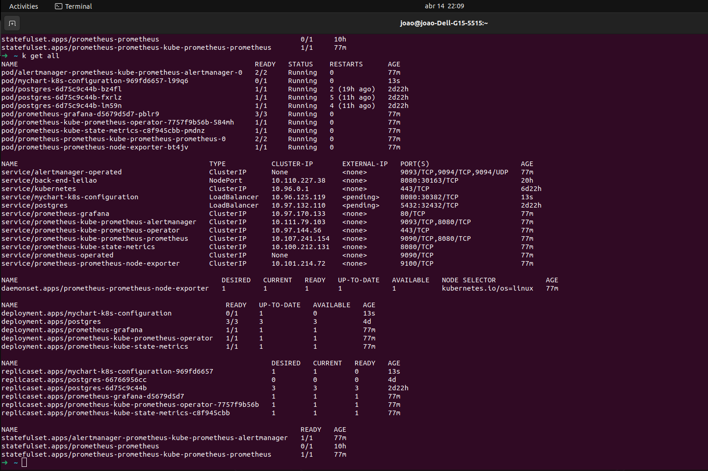

### Prints dos testes no JMeter
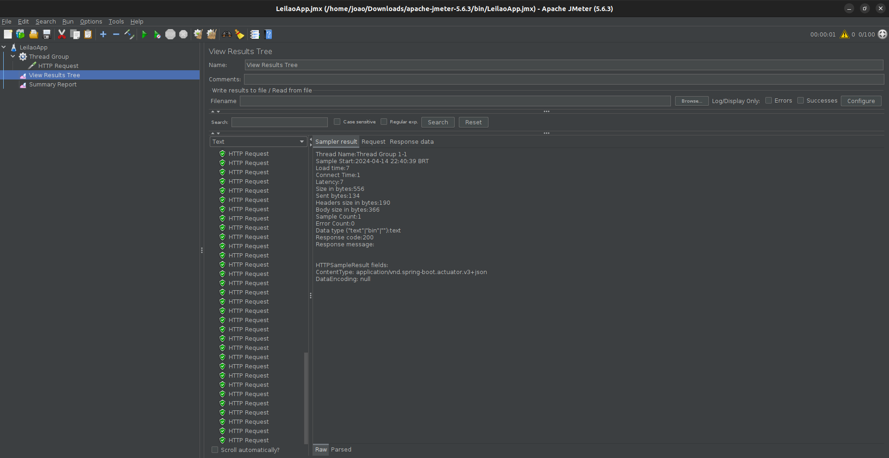
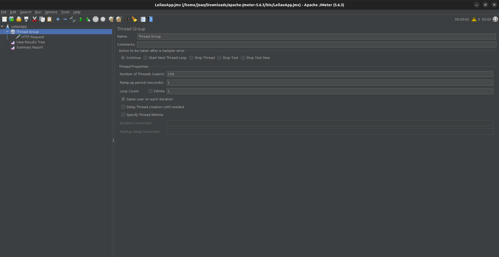
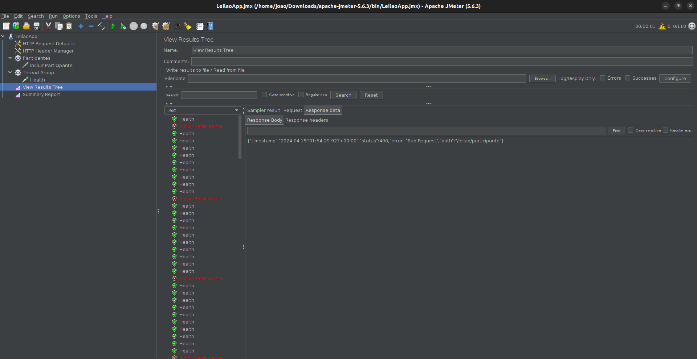

### Print de um gráfico da api spring no Grafana
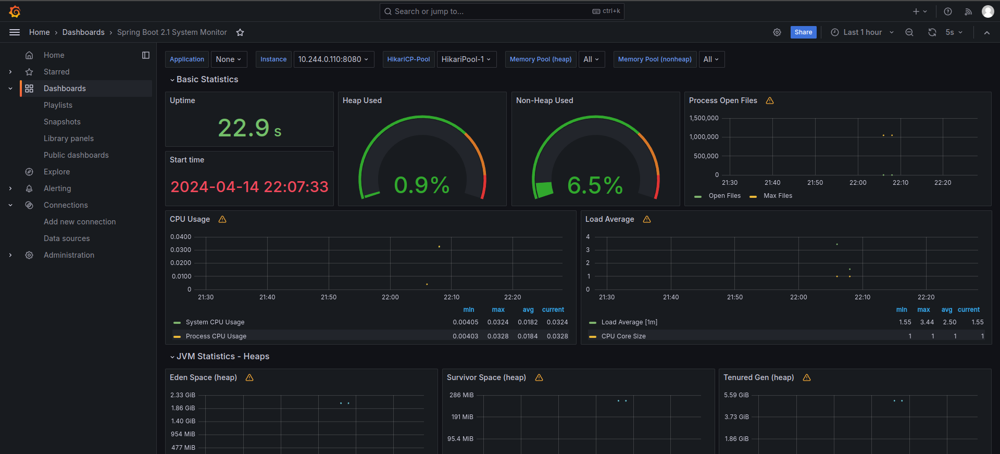

	
